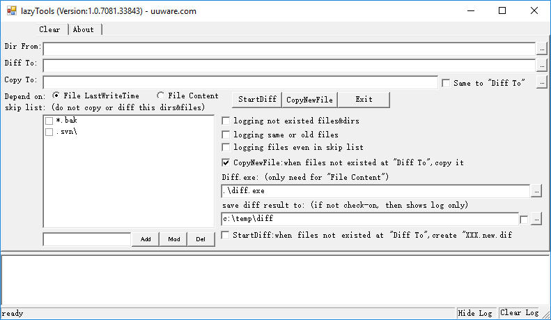
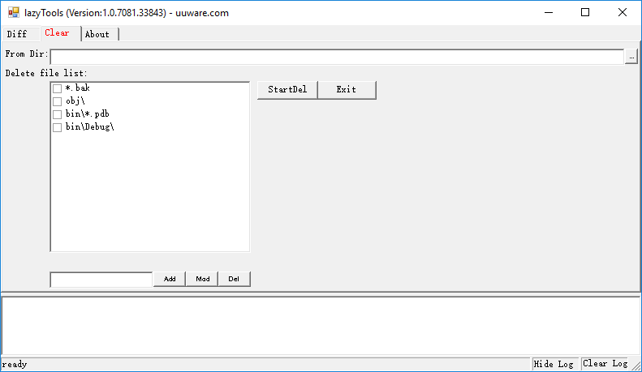

# difftool
When we modify a project with many files, then we maybe want to know which files have been modified and want to take out the modified files only. This tool is developed for this purpose.  This tool also can be used to clear particular files. 
 
You can download the windows executable file:<a href="hslp/diffTool.zip">diffTool.zip</a> 
Captures 
 
 
